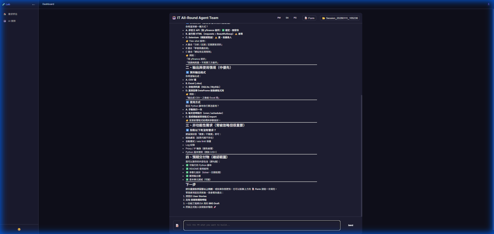
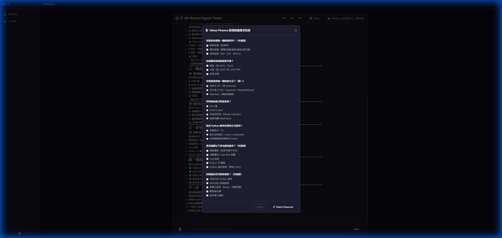
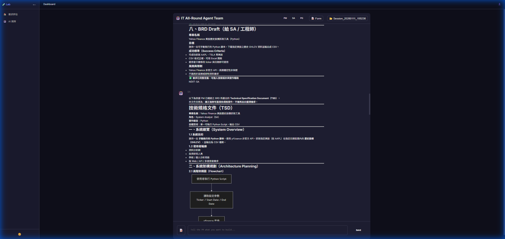
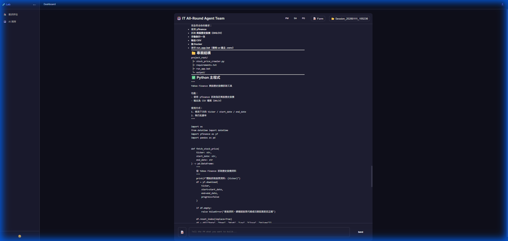

# 🧪 RequirementsLab

**AI-Powered Requirement Analysis & Code Generation**

RequirementsLab now features two powerful modes for turning ideas into reality:
1. **Agent Collaboration Hub** (New!): Interactive collaboration with a team of AI Agents.
2. **Classic Mode**: Structured form-based requirement assessment.

---

---

## 🚀 Mode 1: Agent Collaboration Hub (Interactive)
**Path**: `http://localhost:5272/agents`

A multi-agent system where PM, SA, and PG agents collaborate to turn your ideas into running code.

### Workflow Visualized

1. **Chat with PM**
   Tell the PM what you want to build. The agents will discuss and verify requirements.
   

2. **Auto-Secretary (Form Mode)**
   Click **"📝 Form"** to review the structured requirement analysis auto-generated from the chat.
   

3. **Architecture Design**
   The SA Agent analyzes system needs and produces professional Mermaid diagrams.
   

4. **One-Click Execution**
   The PG Agent writes the actual code. Click **"📂 Open Folder"** to access the generated project.
   

---

## 🏛️ Mode 2: Classic Features (Structured)
**Path**: `http://localhost:5272/` (Default)

The original robust workflow for deep feasibility analysis.

- 📝 **Requirement Input Form**: Structured data collection for project goals and scope.
- 🤖 **Dual LLM Architecture**: 
  - LLM 1: Generates potential solutions.
  - LLM 2: Evaluates feasibility (LLM-as-a-Judge).
- 📊 **Feasibility Score**: 0-100 automated scoring.
- 📋 **Implementation Plan**: Generates detailed "Analysis Report" and "Implementation Plan" documents with Gantt charts.

---

## 🛠️ Setup & Tech Stack

1. **Configuration**:
   Copy `appsettings.template.json` to `appsettings.json`.
   ```json
   {
     "AzureOpenAI": {
       "DeploymentName": "gpt-5.2-chat"
     }
   }
   ```
2. **Run**:
   ```bash
   dotnet run
   ```

**Tech Stack**:
- **Framework**: .NET 10 Blazor Server
- **AI Orchestration**: Microsoft.Extensions.AI (MAI)
- **UI**: Markdig (Markdown) + Mermaid.js
- **Security**: OWASP Top 10 Audited

## 📄 License
MIT
